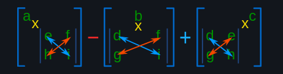

# Chapter No.1 

## Partial Derivatives

1. Partielle Ableitung der Funktion nach jeder der n Variablen
2. Dort wo alle partielle ableitungen einen Nullpunkt haben ist ein critical point
> ein critical point ist ein punkt an dem die funktion nicht mehr steigt oder fällt, dabei kann es sich um ein maximum, ein minimum, ein sattelpunkt oder um nichts handeln.
3. Um herauszufinden um welche art es sich handelt, nimmt man die zweite ableitung aller partiellen Ableitungen.

4. Mit den Werten aus der Ableitung of the second order kann nun eine Hessematrix gebildet werden.

> Bei der Hessematrix handelt es sich um eine Matrix die aus den zweiten Ableitungen der Funktion besteht. 
Die Hessematrix ist symmetrisch und hat die Dimension n x n.
>

1. Von Links oben nach rechts unten lassen sich submatritzen bilden.
2. Von diese submatritzen lässt sich nun die Determinante bilden. Im englishen die Minors

### Task: Find the critical points of the following function 
$$ f(x,y,z) = 2x^2 + xy + 4y^2 + xz + z^2 +2 $$

 

$$ 1.\ First\ Derivation $$
> $$ \text{Take the derivative of the function with respect to each variable} $$ 

$$
   \begin{align*} 
      fx(x,y,z) = 4x + y + z \\
      fy(x,y,z) = x + 8y \\
      fz(x,y,z) = x + 2z \\ 
   \end{align*}
$$

 

$$ 2.\ Critical\ Points $$
> $$ \text{Set the first derivative to zero and solve for each variable} $$

$$
   \begin{align*} 
      fx(p) = 4x + y + z = 0 \Longrightarrow x = 0 \\
      fy(p) = x + 8y = 0  \Longrightarrow y = -\frac{x}{8} \\
      fz(p) = x + 2z = 0 \Longrightarrow z = -\frac{x}{2} 
   \end{align*}
$$

 

$$ 3.\ Second\ Derivation$$
>$$ \text{Take the derivative of the first derivative with respect to each variable} $$

$$ \begin{align*} 
fxx(x,y,z) = 4 && fxy(x,y,z) = 1 && fxz(x,y,z) = 1 && \\
fyx(x,y,z) = 1 && fyy(x,y,z) = 8 && fyz(x,y,z) = 0 && \\
fzx(x,y,z) = 1 && fzy(x,y,z) = 0 && fzz(x,y,z) = 2  
\end{align*} $$

 

$$ 4.\ Hessematrix $$
>$$ \text{Build the Hessematrix} $$

$$ 
\begin{align*} 
   \begin{bmatrix}
      4 & 1 & 1 \\
      1 & 8 & 0 \\
      1 & 0 & 2 
   \end{bmatrix} 
\end {align*}   
$$

 

$$ 5.\ Submatritzen\ and\ determinants$$ 

>$$
   \begin{gather*} 
      \text{Build the submatritzen and calculate the determinants} \\    
      \text{The determinants are called minors} \\
      \text{They are calculated like this:} \\
   \end{gather*}
 $$

>

 

$$
   \begin{gather*} 
      \begin{bmatrix} 
      4 \\
      \end{bmatrix} \Longrightarrow\ \Delta,(p) = 4 \\
      \begin{bmatrix} 
         4 & 1 \\
         1 & 8 \\
      \end{bmatrix} \Longrightarrow \ \Delta,(p) = 31\\
      \begin{bmatrix} 
         4 & 1 & 1 \\
         1 & 8 & 0 \\
         1 & 0 & 2 \\
      \end{bmatrix} \Longrightarrow \ \Delta,(p) = 54 \\
   \end{gather*}
$$

 

$$ 
\begin{gather*}
6.\ Second\ Derivative\ Test \\
\text{1. If all minors are positive, the critical point is a minimum} \\
      \Delta,(p) = 4 > 0 \\
      \Delta,(p) = 31 > 0 \\
      \Delta,(p) = 54 > 0 \\
\text{2. If all minors are negative, the critical point is a maximum} \\
      \Delta,(p) = 4 \not < 0 \\
      \Delta,(p) = 31 \not < 0 \\
      \Delta,(p) = 54 \not < 0 \\
\text{3. If one minor is positive and one is negative, the critical point is a saddle point} \\
      \Delta,(p) = 4 > 0 \\
      \Delta,(p) = 31 \not < 0 \\
      \Delta,(p) = 54 \not < 0 \\
      \vdots \\
\text{4. If one minor is zero, the critical point is neither a minimum nor a maximum} \\
      \Delta,(p) = 4 \not = 0 \\
      \Delta,(p) = 31 \not = 0 \\
      \Delta,(p) = 54 \not = 0 \\
\end{gather*}
$$

