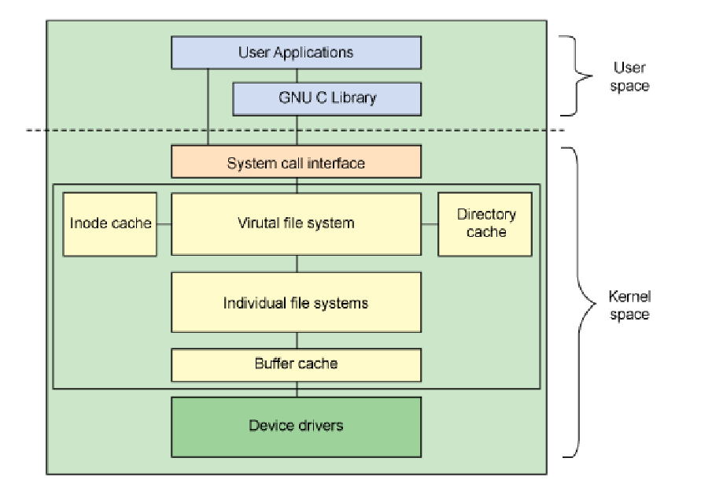
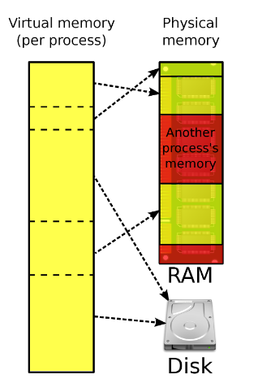
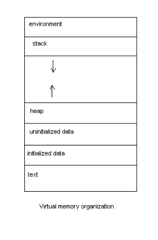
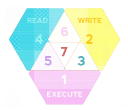

## Lesson No3 

## Kernel 
### What is the kernel?
Provides an interface to the hardware in form of system calls.
It Provides a low level abstraction of the actual hardware to the programs on higher levels.
It is the core of the operating system.

Even registers and memory are a virtual representation of the actual hardware.
The kernel is the only part of the operating system that can directly access the hardware.  

### Monolithic vs Microkernel

#### Monolithic
They share the same address space and are tightly coupled.
They are easier to implement and but harder to maintain.
If the kernel crashes the whole system crashes.
The tight coupling makes it more efficient and faster but also more vulnerable to security issues.

#### Microkernel
They are loosely coupled and have different address spaces.
They are harder to implement but easier to maintain.
Works based on a client-server model via IPC (Inter Process Communication).
The kernel is split into multiple servers that provide services to the clients.

### Drivers 
The kernel provides an interface to the actual hardware via drivers. Only by way of the proper drivers the kernel is abel to interact with the hardware and provide the services to the programms.

### Access to kernelspace
A programm may not simply access resouces within the kernelspace directly.
If it attempts to do so it will be terminated by the kernel with a SIGSEGV signal.

If a program needs to reach into the kernalspace it can do so by using the system call interface, to ask the kernel nicceley to do something for it. 
>


### Virtual Memory and File System
The memory provided to the programms is virtualised by the kernel, to present a uniform view of the memory to the programms.

The actual memeory on the chips is fragmentet and all over the place, to make it easier to manage the memory the kernel provides a virtual memory space to the programms.


|  |   |
|----------------|-----------------|
||
|


A Section of virtual memory is segmentet into 6 different areas:
- Environment Variables
- Stack
  - Function arguments
  - Return addresses
  - Automatic variables
- Heap
  - Dynamic allocation (eg data by malloc)
- Data
  - Initialized global variables
  - uninitialized global variables
  - static variables
- Text
  - The actual instructions of the program
  
## Permission

The Unix permission system is based on the idea of a file being owned by a user and a group. The owner of the file can read, write and execute the file. The group can read and execute the file. Everyone else can only read the file.


It is represented by three groups of three letters (rwx) for the owner, group and others. The letters represent read, write and execute permissions. The permissions are set by the chmod command.

This is how the permission data of a file looks like as provided by ls -l:

``` 
[jon:~]$ ls -l test  
-rw-r--r--. 1 jon jon 0 Jan 30 11:41 test
```
The first 10 characters are the permissions. The next character is the number of hard links to the file. The next two are the owner and group of the file. The next is the size of the file in bytes. The next is the date and time of the last modification. The last is the name of the file.

The letters of permission are also represented by numbers. The numbers are added together to get the total permissions. The numbers are as follows:
- 1 = execute
- 2 = write
- 4 = read

If a user or a group has more than one of these permissions, the numbers are added together. 
For example: 
<br> If a user has read and write permissions, the number is 6. 
<br> If a user has read, write and execute permissions, the number is 7.

